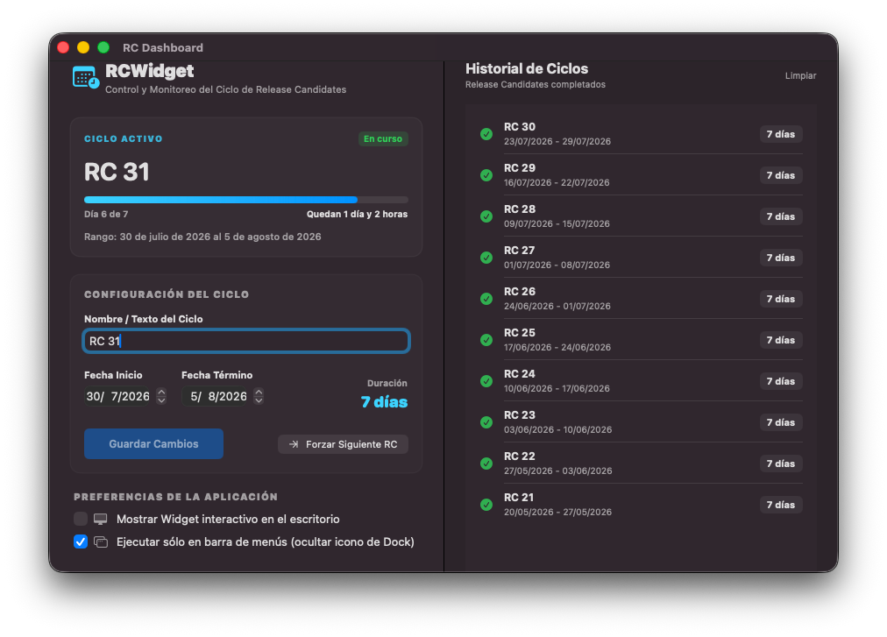
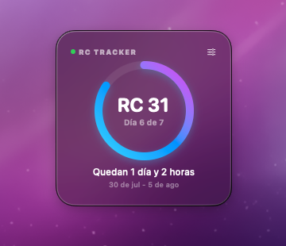
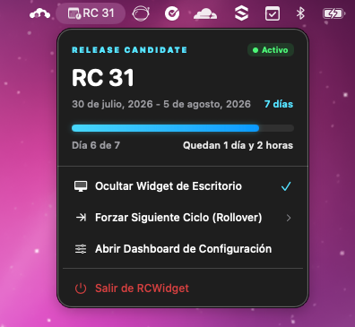

# 🗓️ RCWidget - macOS Release Candidate Cycle Tracker

`RCWidget` es una aplicación nativa para macOS diseñada específicamente para desarrolladores y equipos de producto que necesitan monitorear y gestionar los ciclos de **Release Candidate (RC)**. Desarrollada de forma híbrida con **SwiftUI** y **AppKit**, ofrece una experiencia visualmente espectacular, interactiva y perfectamente integrada en el ecosistema de macOS.

La aplicación consta de tres componentes visuales principales: un **Dashboard de Configuración** completo, un **Widget de Escritorio Glassmórfico** flotante y un **Widget de Barra de Menús** altamente interactivo.

---

## 📸 Capturas de Pantalla (Interfaces Implementadas)

### 1. Dashboard de Configuración
Un completo centro de control para configurar tus ciclos activos, ajustar preferencias de la app y visualizar el historial de RCs completadas.



### 2. Widget de Escritorio Glassmórfico
Un elegante y minimalista widget flotante con efecto de cristal esmerilado que se integra de manera fluida con tu fondo de pantalla y Spaces.



### 3. Widget de Barra de Menús (Dropdown)
Acceso rápido e interactivo directamente desde la barra de estado de macOS para ver el progreso actual y realizar acciones rápidas.



---

## 🚀 Características Principales (Features)

### 1. Dashboard de Control Centralizado (`DashboardView`)
*   **Monitoreo del Ciclo Activo:** Tarjeta de resumen premium que muestra el progreso del ciclo actual en tiempo real mediante una barra de progreso lineal degradada en tonos cian y azul.
*   **Editor Dinámico de Ciclo:** Formulario reactivo para configurar el nombre del ciclo, la fecha de inicio y de término mediante selectores de fecha nativos de macOS (`DatePicker`).
*   **Cálculo de Duración en Vivo:** Calcula e informa la duración total en días a medida que modificas las fechas, validando en tiempo real que la fecha de término sea posterior a la de inicio.
*   **Historial y Archivo Automático:** Un panel derecho que recopila y muestra de forma cronológica inversa todos los ciclos finalizados con un check verde de completado, su rango de fechas y la duración total. Cuenta con la opción de limpiar el historial cuando se desee.
*   **Preferencias del Sistema:** Toggles directos para habilitar/deshabilitar el widget de escritorio y activar el **modo Menu-Bar-Only** (que oculta o muestra dinámicamente el icono de la aplicación en el Dock).

### 2. Widget de Escritorio Flotante e Interactivo (`DesktopWidgetView`)
*   **Estética Glassmorphic Premium:** Utiliza `NSVisualEffectView` de AppKit con material de sistema `.hudWindow` para lograr un fondo traslúcido y esmerilado con bordes degradados de alta fidelidad que reaccionan a la luz del fondo de pantalla.
*   **Indicador de Anillo Circular:** Un medidor circular interactivo pintado con un degradado dinámico (Cian ➡️ Azul ➡️ Púrpura) que ilustra el porcentaje completado del ciclo.
*   **Soporte Multi-Espacio (Virtual Desktops):** Configurado con comportamientos de colección de ventana (`.canJoinAllSpaces` y `.fullScreenAuxiliary`) para flotar en todas las pantallas virtuales y escritorios virtuales sin desaparecer.
*   **Interacción y Posicionamiento Persistente:** Ventana sin bordes y movible haciendo clic y arrastrando desde cualquier parte de su fondo. Guarda su última posición física automáticamente en `UserDefaults` para restaurarla perfectamente al iniciar la app.
*   **Efectos Micro-Interactivos:** Detección de cursor (`onHover`) que revela sutilmente un botón de configuración para abrir instantáneamente el Dashboard con una animación fluida de opacidad y escala.

### 3. Widget Auxiliar en la Barra de Menús (`MenuBarWidgetView`)
*   **Status Item Nativo:** Se posiciona en la barra de menú superior de macOS mostrando un icono de calendario y reloj con el título corto del ciclo activo (ej: `RC 1`).
*   **Acciones Rápidas Dropdown:** Al hacer clic, despliega una vista compacta pero completa con:
    *   Información detallada del ciclo activo (Fechas y días restantes).
    *   Barra de progreso interactiva.
    *   Botón para mostrar/ocultar el widget de escritorio en tiempo real.
    *   Botón para **Forzar Rollover (Forzar Siguiente Ciclo)** manual.
    *   Acceso directo para abrir el Dashboard de Configuración.
    *   Opción para cerrar la aplicación de manera segura.

### 4. Automatización Inteligente y Lógica "Catch-Up"
*   **Auto-Rollover de Ciclos:** Una vez que la fecha de término del ciclo activo expira, la aplicación archiva automáticamente el ciclo completado en el historial de forma permanente.
*   **Auto-Incremento de Título por Regex:** Utiliza expresiones regulares (`NSRegularExpression`) para detectar números al final del título (ej: `"RC 1"`) y los incrementa matemáticamente a la siguiente iteración (ej: `"RC 2"`), manteniendo intacto el prefijo de texto.
*   **Herencia de Duración:** El ciclo nuevo hereda exactamente la duración en días establecida por el usuario en el ciclo anterior, calculando de manera inteligente su nueva fecha de inicio y término a partir del día siguiente de la expiración.
*   **Loop de Puesta al Día (Catch-Up Loop):** Si el usuario pasa semanas sin abrir la aplicación, un algoritmo cronometrado ejecuta un catch-up en bucle al iniciar para procesar, archivar en secuencia cronológica todos los ciclos que debieron haber transcurrido en ese período, y establecer el ciclo activo en la fecha y número correctos.

---

## 🛠️ Stack Tecnológico

*   **Lenguaje:** Swift 5.9+
*   **Framework de Interfaz:** SwiftUI (Vistas reactivas, gradientes y animaciones)
*   **Integración de Ventana:** AppKit (`NSWindow`, `NSVisualEffectView`, `NSHostingView`)
*   **Persistencia Local:** `UserDefaults` con serialización `Codable` (`JSONEncoder` / `JSONDecoder`) para ciclos y configuraciones.
*   **Reactividad:** Combine (`Timer.publish`, `@Published`, `ObservableObject`)
*   **Compatibilidad:** macOS 13.0 Ventura o superior

---

## 📥 Instrucciones de Ejecución y Desarrollo

1.  Asegúrate de contar con un equipo con **macOS 13.0+** y **Xcode 14.0+** instalado.
2.  Clona el repositorio en tu máquina local:
    ```bash
    git clone https://github.com/erikfloresq/RCWidget.git
    cd RCWidget
    ```
3.  Abre el archivo de proyecto en Xcode:
    ```bash
    open RCWidget.xcodeproj
    ```
4.  Selecciona el target de ejecución **RCWidget** y haz clic en **Run** (o presiona `Cmd + R`).
5.  ¡Listo! Verás el icono del calendario aparecer en tu barra de menús en la esquina superior derecha. Haz clic en él para desplegar el widget o para abrir el Dashboard de Configuración principal.

---

## 🌟 Créditos y Licencia

Diseñado e implementado con pasión para macOS. Licencia MIT. Desarrollado por **Erik Flores**.
